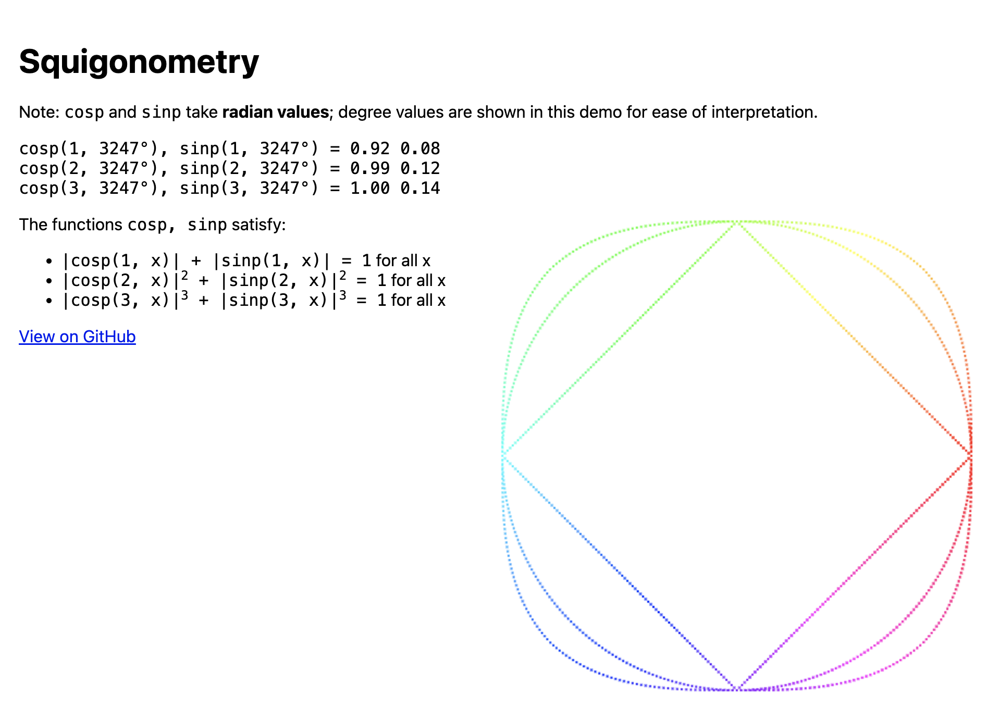

# Squigonometry

Trigonometric functions in $p$-norms for JavaScript; supports $p = 1, 2, 3$. Helpful for drawing squircles.



## Usage

```
npm install squigonometry
```

then

```ts
import { sinp, cosp } from "squigonometry";

const canvas = document.getElementById("canvas");

canvas.width = window.innerWidth;
canvas.height = window.innerHeight;

let degrees = 0;

function render() {
  const ctx = canvas.getContext("2d");
  const width = window.innerWidth;
  const height = window.innerHeight;
  const minorAxis = Math.min(width, height);

  const cosp1Value = cosp(1, (degrees / 180) * Math.PI);
  const sinp1Value = sinp(1, (degrees / 180) * Math.PI);
  const x1 = cosp1Value * (minorAxis / 4) + width / 2;
  // Multiply by -1 to flip the y-axis (<canvas> coordinates are measured top-down)
  const y1 = -sinp1Value * (minorAxis / 4) + height / 2;

  ctx.fillStyle = `hsl(${degrees}, 100%, 50%)`;
  ctx.fillRect(x1, y1, 2, 2);

  const cosp2Value = cosp(2, (degrees / 180) * Math.PI);
  const sinp2Value = sinp(2, (degrees / 180) * Math.PI);
  const x2 = cosp2Value * (minorAxis / 4) + width / 2;
  const y2 = -sinp2Value * (minorAxis / 4) + height / 2;

  ctx.fillStyle = `hsl(${degrees}, 100%, 50%)`;
  ctx.fillRect(x2, y2, 2, 2);

  const cosp3Value = cosp(3, (degrees / 180) * Math.PI);
  const sinp3Value = sinp(3, (degrees / 180) * Math.PI);
  const x3 = cosp3Value * (minorAxis / 4) + width / 2;
  const y3 = -sinp3Value * (minorAxis / 4) + height / 2;

  ctx.fillStyle = `hsl(${degrees}, 100%, 50%)`;
  ctx.fillRect(x3, y3, 2, 2);

  degrees += 1;

  requestAnimationFrame(render);
}

requestAnimationFrame(render);
```

## Roadmap

- Support for $p = 4$ (i.e. a true [squircle](https://en.wikipedia.org/wiki/Squircle)). Should be doable using the formula for Taylor series from https://digitalresearch.bsu.edu/mathexchange/wp-content/uploads/2022/11/2022_1_CHKMW.pdf

## Contributing

- `npm build` to package for NPM
- `npm test` to run tests
- `npm run demo` to run the demo webpage (runs at http://localhost:8080)
